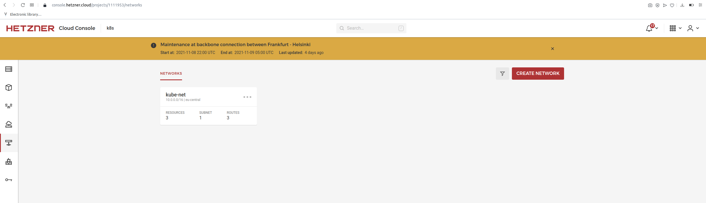

# Kubernetes on Hetzner Cloud using terrafrom and kubeadm

This repository helps us to setup an Kubernetes Cluster with [kubeadm](https://kubernetes.io/docs/setup/independent/create-cluster-kubeadm/) on [Hetzner Cloud](https://www.hetzner.com/cloud).

## Components

- Kubernetes 1.20
- kubeadm
- Containerd (installation without docker)
- Flannel CNI
- Hetzner private network for node communication
- Hetzner firewall to protect nodes (only master ports 22, 6443 are opened)
- Hetzner cloud-controller-manager to set external node-ips, create loadbalancers and update private network routes
- Hetzner CSI to use Hetzner volumes in Kubernetes

## Inspired by

- https://github.com/solidnerd/terraform-k8s-hcloud @solidnerd
- https://github.com/jpsikorra/k8s-hetzner-test @jpsikorra

## Usage

```
$ terraform init
$ cp production.tfvars terraform.tfvars
$ terraform apply 
$ KUBECONFIG=tmp/admin.conf kubectl get nodes
```

## Variables

Note: All variables cloud be passed through `environment variables` or a `terraform.tfvars` file.


## Example:


```
$ terraform apply 
...

Apply complete! Resources: 21 added, 0 changed, 0 destroyed.

Outputs:

master_ips = [
  [
    "49.12.5.242",
  ],
]
node_ips = [
  [
    "23.88.124.208",
    "23.88.123.16",
  ],
]

$ KUBECONFIG=tmp/admin.conf kubectl get nodes -o wide
NAME            STATUS   ROLES                  AGE   VERSION   INTERNAL-IP   EXTERNAL-IP     OS-IMAGE             KERNEL-VERSION     CONTAINER-RUNTIME
kube-master-1   Ready    control-plane,master   11m   v1.20.2   10.0.0.10     49.12.5.242     Ubuntu 20.04.3 LTS   5.4.0-89-generic   containerd://1.5.5
kube-node-1     Ready    <none>                 10m   v1.20.2   10.0.0.100    23.88.124.208   Ubuntu 20.04.3 LTS   5.4.0-89-generic   containerd://1.5.5
kube-node-2     Ready    <none>                 10m   v1.20.2   10.0.0.101    23.88.123.16    Ubuntu 20.04.3 LTS   5.4.0-89-generic   containerd://1.5.5


$ KUBECONFIG=tmp/admin.conf kubectl get all --all-namespaces -o wide
NAMESPACE     NAME                                                   READY   STATUS    RESTARTS   AGE   IP           NODE            NOMINATED NODE   READINESS GATES
kube-system   pod/coredns-74ff55c5b-6x2jt                            1/1     Running   0          11m   10.244.1.3   kube-node-2     <none>           <none>
kube-system   pod/coredns-74ff55c5b-9wdcf                            1/1     Running   0          11m   10.244.1.4   kube-node-2     <none>           <none>
kube-system   pod/etcd-kube-master-1                                 1/1     Running   0          11m   10.0.0.10    kube-master-1   <none>           <none>
kube-system   pod/hcloud-cloud-controller-manager-6ff7888dff-qf4qx   1/1     Running   0          11m   10.0.0.10    kube-master-1   <none>           <none>
kube-system   pod/hcloud-csi-controller-0                            5/5     Running   0          11m   10.244.1.5   kube-node-2     <none>           <none>
kube-system   pod/hcloud-csi-node-2bb4m                              3/3     Running   0          11m   10.244.0.2   kube-master-1   <none>           <none>
kube-system   pod/hcloud-csi-node-6lkr5                              3/3     Running   0          11m   10.244.1.2   kube-node-2     <none>           <none>
kube-system   pod/hcloud-csi-node-fgtb9                              3/3     Running   0          11m   10.244.2.2   kube-node-1     <none>           <none>
kube-system   pod/kube-apiserver-kube-master-1                       1/1     Running   0          11m   10.0.0.10    kube-master-1   <none>           <none>
kube-system   pod/kube-controller-manager-kube-master-1              1/1     Running   0          11m   10.0.0.10    kube-master-1   <none>           <none>
kube-system   pod/kube-flannel-ds-27srs                              1/1     Running   0          11m   10.0.0.101   kube-node-2     <none>           <none>
kube-system   pod/kube-flannel-ds-qjbn5                              1/1     Running   0          11m   10.0.0.10    kube-master-1   <none>           <none>
kube-system   pod/kube-flannel-ds-r8smn                              1/1     Running   0          11m   10.0.0.100   kube-node-1     <none>           <none>
kube-system   pod/kube-proxy-728dj                                   1/1     Running   0          11m   10.0.0.100   kube-node-1     <none>           <none>
kube-system   pod/kube-proxy-8np72                                   1/1     Running   0          11m   10.0.0.10    kube-master-1   <none>           <none>
kube-system   pod/kube-proxy-tmjxg                                   1/1     Running   0          11m   10.0.0.101   kube-node-2     <none>           <none>
kube-system   pod/kube-scheduler-kube-master-1                       1/1     Running   0          11m   10.0.0.10    kube-master-1   <none>           <none>

NAMESPACE     NAME                                    TYPE        CLUSTER-IP      EXTERNAL-IP   PORT(S)                  AGE   SELECTOR
default       service/kubernetes                      ClusterIP   10.96.0.1       <none>        443/TCP                  11m   <none>
kube-system   service/hcloud-csi-controller-metrics   ClusterIP   10.96.47.120    <none>        9189/TCP                 11m   app=hcloud-csi-controller
kube-system   service/hcloud-csi-node-metrics         ClusterIP   10.96.188.249   <none>        9189/TCP                 11m   app=hcloud-csi
kube-system   service/kube-dns                        ClusterIP   10.96.0.10      <none>        53/UDP,53/TCP,9153/TCP   11m   k8s-app=kube-dns

NAMESPACE     NAME                             DESIRED   CURRENT   READY   UP-TO-DATE   AVAILABLE   NODE SELECTOR            AGE   CONTAINERS                                                   IMAGES                                                                                                                                     SELECTOR
kube-system   daemonset.apps/hcloud-csi-node   3         3         3       3            3           <none>                   11m   csi-node-driver-registrar,hcloud-csi-driver,liveness-probe   k8s.gcr.io/sig-storage/csi-node-driver-registrar:v2.2.0,hetznercloud/hcloud-csi-driver:1.6.0,k8s.gcr.io/sig-storage/livenessprobe:v2.3.0   app=hcloud-csi
kube-system   daemonset.apps/kube-flannel-ds   3         3         3       3            3           <none>                   11m   kube-flannel                                                 quay.io/coreos/flannel:v0.13.0                                                                                                             app=flannel
kube-system   daemonset.apps/kube-proxy        3         3         3       3            3           kubernetes.io/os=linux   11m   kube-proxy                                                   k8s.gcr.io/kube-proxy:v1.20.12                                                                                                             k8s-app=kube-proxy

NAMESPACE     NAME                                              READY   UP-TO-DATE   AVAILABLE   AGE   CONTAINERS                        IMAGES                                                SELECTOR
kube-system   deployment.apps/coredns                           2/2     2            2           11m   coredns                           k8s.gcr.io/coredns:1.7.0                              k8s-app=kube-dns
kube-system   deployment.apps/hcloud-cloud-controller-manager   1/1     1            1           11m   hcloud-cloud-controller-manager   hetznercloud/hcloud-cloud-controller-manager:v1.9.1   app=hcloud-cloud-controller-manager

NAMESPACE     NAME                                                         DESIRED   CURRENT   READY   AGE   CONTAINERS                        IMAGES                                                SELECTOR
kube-system   replicaset.apps/coredns-74ff55c5b                            2         2         2       11m   coredns                           k8s.gcr.io/coredns:1.7.0                              k8s-app=kube-dns,pod-template-hash=74ff55c5b
kube-system   replicaset.apps/hcloud-cloud-controller-manager-6bd9b4fbf4   0         0         0       11m   hcloud-cloud-controller-manager   hetznercloud/hcloud-cloud-controller-manager:v1.9.1   app=hcloud-cloud-controller-manager,pod-template-hash=6bd9b4fbf4
kube-system   replicaset.apps/hcloud-cloud-controller-manager-6ff7888dff   1         1         1       11m   hcloud-cloud-controller-manager   hetznercloud/hcloud-cloud-controller-manager:v1.9.1   app=hcloud-cloud-controller-manager,pod-template-hash=6ff7888dff
kube-system   replicaset.apps/hcloud-cloud-controller-manager-75c979d97c   0         0         0       11m   hcloud-cloud-controller-manager   hetznercloud/hcloud-cloud-controller-manager:v1.9.1   app=hcloud-cloud-controller-manager,pod-template-hash=75c979d97c

NAMESPACE     NAME                                     READY   AGE   CONTAINERS                                                                  IMAGES
kube-system   statefulset.apps/hcloud-csi-controller   1/1     11m   csi-attacher,csi-resizer,csi-provisioner,hcloud-csi-driver,liveness-probe   k8s.gcr.io/sig-storage/csi-attacher:v3.2.1,k8s.gcr.io/sig-storage/csi-resizer:v1.2.0,k8s.gcr.io/sig-storage/csi-provisioner:v2.2.2,hetznercloud/hcloud-csi-driver:1.6.0,k8s.gcr.io/sig-storage/livenessprobe:v2.3.0
```





## hello app - creating Volume and Load Balancer @hcloud using hcloud CCM & CSI k8s add-ons

```
$ KUBECONFIG=tmp/admin.conf kubectl apply -f hello/hello-kubernetes-default.yaml 
deployment.apps/hello-kubernetes created
service/hello-kubernetes created
persistentvolumeclaim/csi-pvc created

$ KUBECONFIG=tmp/admin.conf kubectl get all
NAME                                   READY   STATUS              RESTARTS   AGE
pod/hello-kubernetes-7d8757d7c-2wl84   0/1     ContainerCreating   0          10s

NAME                       TYPE           CLUSTER-IP     EXTERNAL-IP                                 PORT(S)          AGE
service/hello-kubernetes   LoadBalancer   10.96.16.241   10.0.0.2,2a01:4f8:c011:e6::1,49.12.21.176   8080:32322/TCP   11s
service/kubernetes         ClusterIP      10.96.0.1      <none>                                      443/TCP          16m

NAME                               READY   UP-TO-DATE   AVAILABLE   AGE
deployment.apps/hello-kubernetes   0/1     1            0           11s

NAME                                         DESIRED   CURRENT   READY   AGE
replicaset.apps/hello-kubernetes-7d8757d7c   1         1         0       11s

```


## Clean 

Delete Volume and Load Balancer via hcloud cli or hcloud console UI.

```
$ terraform destroy 

...
Destroy complete! Resources: 21 destroyed.

```


